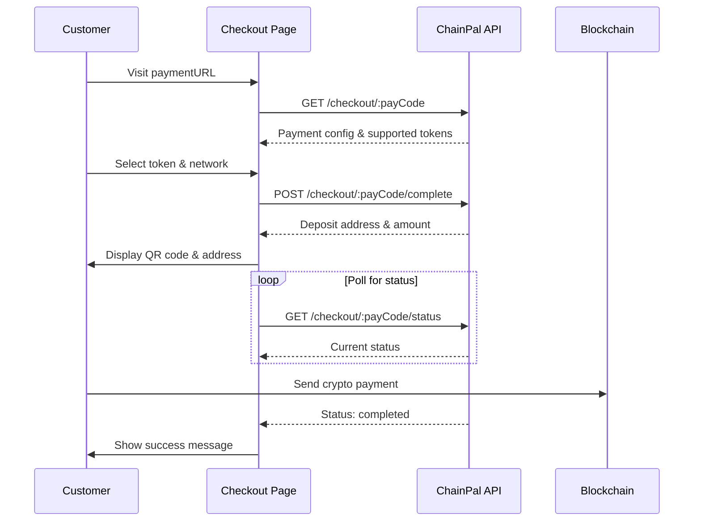

# Checkout API

The Checkout API provides endpoints for the customer-facing payment flow. These endpoints power the hosted checkout page at `pay.chainpal.org`.

<Note>
  These endpoints are used by the hosted checkout page. You typically don't need
  to call them directly unless you're building a custom checkout experience.
</Note>

## Get Checkout Data

Retrieves the payment configuration for a checkout session. This includes supported tokens/networks, amount limits, and business branding.

```http
GET /checkout/:payCode
```

### Path Parameters

| Parameter | Type     | Required | Description                                         |
| :-------- | :------- | :------- | :-------------------------------------------------- |
| `payCode` | `string` | Yes      | The 12-character payment code from the checkout URL |

### Example Request

```bash
curl https://api.chainpal.org/checkout/abc123xyz456
```

### Response

```json
{
  "success": true,
  "message": "payment data fetched successfully",
  "data": {
    "id": "507f1f77bcf86cd799439011",
    "customerEmail": "customer@example.com",
    "memo": "",
    "paymentReference": "checkoutORDER12345",
    "paymentStatus": "pending",
    "paymentAmount": "5000.00",
    "paymentCurrency": "NGN",
    "supportedTokens": ["USDC", "USDT"],
    "supportedNetworksPerToken": {
      "USDC": ["base", "celo", "polygon"],
      "USDT": ["celo", "polygon"]
    },
    "businessName": "Acme Corp",
    "logoURL": "https://example.com/logo.png",
    "status": "pending",
    "environment": "test",
    "minimumOutputAmount": 1000,
    "maximumOutputAmount": 1000000,
    "minimumUSDAmount": 1,
    "maximumUSDAmount": 2000,
    "createdAt": "2024-01-15T14:00:00Z",
    "updatedAt": "2024-01-15T14:00:00Z"
  }
}
```

### Response Fields

| Field                       | Type     | Description                                 |
| :-------------------------- | :------- | :------------------------------------------ |
| `id`                        | `string` | Payment ID                                  |
| `customerEmail`             | `string` | Customer's email                            |
| `paymentReference`          | `string` | Payment reference                           |
| `paymentStatus`             | `string` | Current status                              |
| `paymentAmount`             | `string` | Fiat amount to be paid                      |
| `paymentCurrency`           | `string` | Fiat currency (NGN, GHS, KES, ZAR, or USD)  |
| `supportedTokens`           | `array`  | Available cryptocurrency tokens             |
| `supportedNetworksPerToken` | `object` | Map of token to available networks          |
| `businessName`              | `string` | Merchant's business name                    |
| `logoURL`                   | `string` | URL to merchant's logo                      |
| `status`                    | `string` | Payment status                              |
| `environment`               | `string` | `test` or `live`                            |
| `minimumOutputAmount`       | `number` | Minimum fiat amount allowed                 |
| `maximumOutputAmount`       | `number` | Maximum fiat amount allowed                 |
| `minimumUSDAmount`          | `number` | Minimum USD amount (when collecting in USD) |
| `maximumUSDAmount`          | `number` | Maximum USD amount (when collecting in USD) |

---

## Complete Checkout

Locks the payment to a specific token/network and generates a deposit address. After calling this endpoint, the customer has a limited time to complete the payment.

```http
POST /checkout/:payCode/complete
```

### Path Parameters

| Parameter | Type     | Required | Description      |
| :-------- | :------- | :------- | :--------------- |
| `payCode` | `string` | Yes      | The payment code |

### Request Body

| Parameter | Type     | Required | Description                                |
| :-------- | :------- | :------- | :----------------------------------------- |
| `token`   | `string` | Yes      | Selected cryptocurrency (`USDT` or `USDC`) |
| `network` | `string` | Yes      | Selected blockchain network                |

### Example Request

```bash
curl -X POST https://api.chainpal.org/checkout/abc123xyz456/complete \
  -H "Content-Type: application/json" \
  -d '{
    "token": "USDC",
    "network": "base"
  }'
```

### Response

```json
{
  "success": true,
  "message": "api payment processing",
  "data": {
    "receiveAddress": "0x1234567890abcdef1234567890abcdef12345678",
    "validUntil": "2024-01-15T15:00:00Z",
    "totalPayableAmount": "3.029024"
  }
}
```

### Response Fields

| Field                | Type     | Description                                            |
| :------------------- | :------- | :----------------------------------------------------- |
| `receiveAddress`     | `string` | The deposit address for the customer to send crypto to |
| `validUntil`         | `string` | ISO 8601 timestamp when this address expires           |
| `totalPayableAmount` | `string` | The exact crypto amount the customer must send         |

<Warning>
  The customer must send the **exact** `totalPayableAmount` to the
  `receiveAddress` before `validUntil`. Underpayments or late payments may not
  be processed automatically.
</Warning>

---

## Poll Checkout Status

Retrieves the current status of a checkout session. Use this for polling to detect when payment is received.

```http
GET /checkout/:payCode/status
```

### Path Parameters

| Parameter | Type     | Required | Description      |
| :-------- | :------- | :------- | :--------------- |
| `payCode` | `string` | Yes      | The payment code |

### Example Request

```bash
curl https://api.chainpal.org/checkout/abc123xyz456/status
```

### Response

```json
{
  "success": true,
  "message": "api payment status fetched successfully",
  "data": "pending"
}
```

### Possible Status Values

| Status       | Description                                  |
| :----------- | :------------------------------------------- |
| `pending`    | Waiting for customer to select token/network |
| `processing` | Payment received, being processed            |
| `completed`  | Payment successful and settled               |
| `expired`    | Payment window expired                       |
| `failed`     | Payment failed                               |

---

## Checkout Flow


